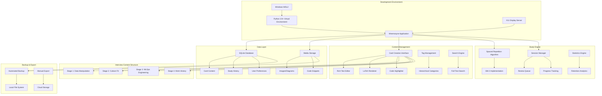
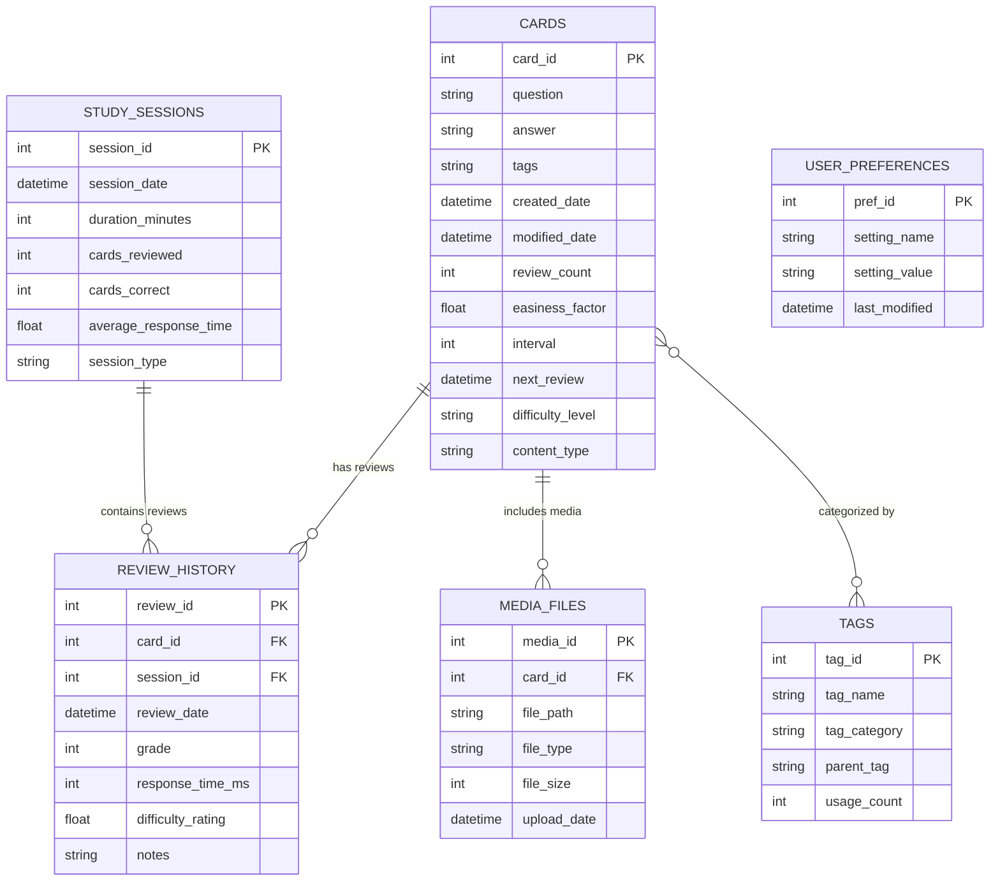

# Interview Preparation System - Complete Planning Document

**Project**: Mnemosyne-Based Interview Preparation System  
**Date**: June 13, 2025  
**Classification**: Simple Planning Request  
**Stakeholder**: Personal Learning System (Single User)

---

## 1. Vision & Scope Statement

### Vision
Establish a robust, efficient flashcard-based learning system using Mnemosyne to master technical concepts for Skyscanner's Senior Software Engineer - Distributed Systems (AI Enablement) interview across four distinct assessment stages.

### Scope
**In Scope:**
- Personal learning system for structured interview preparation
- Support for four interview stages: data manipulation, culture fit, MLOps engineering, work history
- Rich content types: technical concepts, code snippets, behavioral scenarios
- Spaced repetition methodology for optimal retention
- Local desktop installation with backup capabilities
- Content organization and progress tracking

**Out of Scope:**
- Multi-user or collaborative features
- Production-grade infrastructure or CI/CD
- Mobile applications or cross-device synchronization
- Advanced analytics or machine learning features
- Integration with external learning platforms

### Success Criteria
- Complete system setup within 4 hours
- Comprehensive card library covering all interview domains
- Daily study routine established with measurable progress
- 85%+ retention rate on technical concepts
- Confident performance across all interview stages

---

## 2. Software Requirements Specification (SRS)

### 2.1 Functional Requirements

#### FR1: Core Flashcard Management
- **FR1.1**: Create, edit, and delete flashcards with rich text formatting
- **FR1.2**: Support LaTeX mathematical expressions for algorithms/complexity
- **FR1.3**: Code syntax highlighting for Python, SQL, and configuration snippets
- **FR1.4**: Image embedding for system architecture diagrams
- **FR1.5**: Tag-based categorization and filtering system

#### FR2: Interview Stage Organization
- **FR2.1**: Stage 1 - Data Manipulation: pandas, SQL, data processing patterns
- **FR2.2**: Stage 2 - Culture Fit: behavioral scenarios, company values alignment
- **FR2.3**: Stage 3 - MLOps Engineering: pipelines, monitoring, infrastructure concepts
- **FR2.4**: Stage 4 - Work History: experience reflection, technical achievements

#### FR3: Content Management
- **FR3.1**: Hierarchical tagging: Stage → Topic → Difficulty Level
- **FR3.2**: Template-based card creation for consistency
- **FR3.3**: Bulk import/export capabilities for backup
- **FR3.4**: Search functionality across all card content

#### FR4: Study Workflow
- **FR4.1**: Spaced repetition scheduling based on SuperMemo SM-2 algorithm
- **FR4.2**: Customizable study sessions by stage or topic
- **FR4.3**: Progress tracking with retention statistics
- **FR4.4**: Review queue prioritization for upcoming interview

#### FR5: Data Persistence & Backup
- **FR5.1**: SQLite database for card storage and study history
- **FR5.2**: Automated daily backup creation
- **FR5.3**: Export functionality for external backup storage
- **FR5.4**: Database integrity checking and recovery

### 2.2 Non-Functional Requirements

#### NFR1: Performance
- Application startup time: < 10 seconds
- Card rendering time: < 2 seconds per card
- Database queries: < 500ms for search operations
- Support for 1000+ cards without performance degradation

#### NFR2: Usability
- Intuitive keyboard shortcuts for navigation
- Consistent UI patterns across all screens
- Responsive layout for different window sizes
- Clear visual hierarchy and typography

#### NFR3: Reliability
- 99.9% uptime for local application
- Automatic recovery from unexpected shutdowns
- Data consistency across all operations
- Graceful handling of corrupted media files

#### NFR4: Maintainability
- Clean separation between content and application logic
- Standardized card templates for easy content creation
- Clear documentation for customization
- Modular tag hierarchy for scalable organization

---

## 3. Architecture Decision Records (ADRs)

### ADR-001: Flashcard Platform Selection
**Status**: Accepted  
**Date**: 2025-06-13  
**Context**: Need robust spaced repetition system for technical interview preparation  
**Decision**: Use Mnemosyne over Anki, SuperMemo, or custom solution  
**Rationale**:
- Python-native architecture aligns with data science workflow
- Strong spaced repetition algorithm (SuperMemo SM-2 based)
- Rich text and LaTeX support for technical content
- Lighter weight than Anki for focused use case
- Open source with active development

**Consequences**:
- ✅ Simplified setup in Python development environment
- ✅ Excellent support for mathematical and code content
- ✅ No vendor lock-in concerns
- ❌ Smaller community and plugin ecosystem vs Anki
- ❌ Limited mobile support options

### ADR-002: Deployment Architecture
**Status**: Accepted  
**Date**: 2025-06-13  
**Context**: Choose between local installation, web-based, or cloud deployment  
**Decision**: Local desktop installation with manual backup strategy  
**Rationale**:
- Interview preparation requires offline capability
- Better performance and response times
- Complete control over data and privacy
- No dependency on internet connectivity
- Simplified setup without server management

**Consequences**:
- ✅ No internet dependency during study sessions
- ✅ Maximum performance and control
- ✅ Enhanced privacy and data security
- ❌ Manual backup responsibility
- ❌ No automatic cross-device synchronization

### ADR-003: Content Organization Strategy
**Status**: Accepted  
**Date**: 2025-06-13  
**Context**: Need scalable system for organizing diverse interview content  
**Decision**: Three-tier hierarchical tagging: Stage → Topic → Complexity  
**Rationale**:
- Maps directly to interview structure
- Supports focused study sessions
- Enables cross-cutting concept identification
- Scalable for additional content areas
- Simple yet comprehensive organization

**Consequences**:
- ✅ Clear content structure and navigation
- ✅ Efficient filtering and study session creation
- ✅ Easy progress tracking by category
- ❌ Requires disciplined tagging during content creation
- ❌ May need refactoring if interview structure changes

### ADR-004: Development Environment Setup
**Status**: Accepted  
**Date**: 2025-06-13  
**Context**: Integration with existing Windows WSL development environment  
**Decision**: Use Python virtual environment within WSL with Windows GUI access  
**Rationale**:
- Leverages existing WSL setup
- Isolated Python environment prevents conflicts
- Native Linux tools for development workflow
- X11 forwarding for GUI application access

**Consequences**:
- ✅ Clean dependency isolation
- ✅ Familiar development environment
- ✅ Easy integration with existing toolchain
- ❌ Additional X11 setup complexity
- ❌ Potential performance overhead for GUI

---

## 4. High-Level System Architecture

---

## 5. Data Model Overview

### Data Relationships
- **Cards**: Core entity containing question-answer pairs with spaced repetition metadata
- **Study Sessions**: Aggregated study activity with performance metrics
- **Review History**: Individual card review events with grading and timing
- **Tags**: Hierarchical categorization system for content organization
- **Media Files**: Associated images, diagrams, and supplementary content
- **User Preferences**: Application settings and personalization options

---

## 6. Risk & Edge-Case Register

### 6.1 Technical Risks

| Risk | Probability | Impact | Mitigation Strategy |
|------|------------|--------|-------------------|
| Python/PyQt6 dependency conflicts | Medium | High | Use isolated virtual environment, document exact versions |
| WSL X11 display issues | Medium | Medium | Test GUI forwarding, provide alternative Windows installation |
| Large media files affecting performance | Low | Medium | Implement file size limits, optimize image compression |
| Database corruption | Low | High | Automated backups, database integrity checks |
| LaTeX rendering failures | Medium | Low | Fallback to plain text, pre-test LaTeX commands |

### 6.2 Process Risks

| Risk | Probability | Impact | Mitigation Strategy |
|------|------------|--------|-------------------|
| Content creation bottleneck | High | Medium | Template-based creation, bulk import tools |
| Inconsistent tagging strategy | Medium | Medium | Clear tagging guidelines, validation scripts |
| Backup failure unnoticed | Medium | High | Automated backup verification, cloud sync |
| Over-engineering content | Medium | Low | Time-boxed content creation, focus on essentials |
| Study routine abandonment | Low | High | Gamification elements, progress visualization |

### 6.3 Edge Cases

#### Data Handling
- **Unicode Support**: Ensure proper handling of technical symbols, mathematical notation
- **Large Card Sets**: Performance testing with 1000+ cards
- **Concurrent Access**: File locking during backup operations
- **Malformed Content**: Graceful handling of corrupted LaTeX or HTML

#### User Experience
- **Keyboard Shortcuts**: Conflict resolution with system shortcuts
- **Window Management**: Proper behavior across multiple monitors
- **Session Interruption**: Auto-save and recovery mechanisms
- **Search Edge Cases**: Empty queries, special characters, regex patterns

#### System Integration
- **WSL Performance**: GUI application responsiveness
- **File Path Handling**: Windows/Linux path compatibility
- **Resource Cleanup**: Memory management for large media files
- **Permission Issues**: File access in WSL environment

---

## 7. Delivery Roadmap

### Phase 1: Foundation Setup
**Timeline**: Day 1 (2-4 hours)  
**Milestone**: Functional Mnemosyne installation with verified GUI access

**Key Deliverables**:
- Python virtual environment configured in WSL
- Mnemosyne installed with all dependencies
- X11 forwarding functional for GUI access
- Initial database created and tested
- Basic functionality verification complete

**Success Criteria**:
- Application launches successfully
- Can create and review test flashcards
- GUI renders properly in WSL environment
- All core features accessible

### Phase 2: Content Framework
**Timeline**: Day 1-2 (4-6 hours)  
**Milestone**: Structured content organization system ready for content creation

**Key Deliverables**:
- Hierarchical tag system implemented
- Card templates created for each interview stage
- Content creation guidelines documented
- Backup automation configured
- Search and filtering capabilities tested

**Success Criteria**:
- Clear tag hierarchy established
- Templates accelerate card creation
- Backup system creates daily exports
- Content can be efficiently organized and retrieved

### Phase 3: Core Content Development
**Timeline**: Day 2-5 (8-12 hours)  
**Milestone**: Comprehensive card library covering all interview domains

**Key Deliverables**:
- **Data Manipulation**: 60+ cards covering pandas, SQL, data processing
- **Culture Fit**: 40+ behavioral scenario cards with STAR method examples
- **MLOps Engineering**: 50+ cards on pipelines, monitoring, infrastructure
- **Work History**: 30+ reflection cards on technical achievements
- Sample study sessions for each domain

**Success Criteria**:
- All major interview topics covered
- Cards include code examples and technical diagrams
- Behavioral scenarios mapped to company values
- Technical content spans appropriate difficulty levels

### Phase 4: Study Optimization
**Timeline**: Day 5-7 (4-6 hours)  
**Milestone**: Optimized study routine with progress tracking

**Key Deliverables**:
- Daily study schedule established
- Progress tracking dashboard configured
- Review session analytics functional
- Performance optimization completed
- Final preparation checklist created

**Success Criteria**:
- Consistent daily study routine
- Clear progress metrics and trends
- Efficient review sessions
- System performance remains responsive

### Phase 5: Interview Preparation
**Timeline**: Day 7 - Interview Day  
**Milestone**: Interview-ready knowledge base with final review protocols

**Key Deliverables**:
- Intensive review sessions for weak areas
- Mock interview scenario practice
- Quick reference cards for key concepts
- Confidence building exercises
- Final system backup and verification

**Success Criteria**:
- 85%+ retention rate on all content
- Confident performance in practice sessions
- Complete coverage of interview topics
- Optimized review schedule for interview week

---

## 8. Change Control & Feedback Loop Process

### 8.1 Content Evolution Process

#### Daily Review Cycle
1. **Performance Assessment**: Track response accuracy and confidence during study sessions
2. **Content Gap Analysis**: Identify topics requiring additional cards or clarification
3. **Difficulty Adjustment**: Modify spaced repetition intervals based on retention patterns
4. **Content Quality Review**: Update cards with improved explanations or examples

#### Weekly Optimization Cycle
1. **Tag Structure Review**: Assess effectiveness of categorization system
2. **Study Pattern Analysis**: Evaluate time allocation across interview stages
3. **Progress Milestone Check**: Compare actual vs planned learning objectives
4. **System Performance Audit**: Monitor application responsiveness and backup integrity

### 8.2 Continuous Improvement Framework

#### Feedback Collection Methods
- **Quantitative Metrics**: Retention rates, response times, session completion rates
- **Qualitative Assessment**: Content clarity, difficulty appropriateness, practical relevance
- **Usage Analytics**: Most/least reviewed topics, search patterns, error frequencies
- **Mock Interview Results**: Performance correlation with study focus areas

#### Change Implementation Protocol
1. **Change Request**: Document specific improvement need with rationale
2. **Impact Assessment**: Evaluate effect on existing content and study schedule
3. **Implementation Planning**: Schedule changes to minimize study disruption
4. **Validation Testing**: Verify changes improve learning outcomes
5. **Documentation Update**: Maintain current content guidelines and procedures

### 8.3 Quality Assurance Measures

#### Content Quality Standards
- **Technical Accuracy**: All code examples tested and verified
- **Consistency**: Uniform formatting and style across card types
- **Completeness**: Adequate coverage depth for interview requirements
- **Relevance**: Direct applicability to Skyscanner role requirements

#### System Reliability Checks
- **Daily**: Backup verification and database integrity
- **Weekly**: Performance monitoring and cleanup operations
- **Bi-weekly**: Content statistics and progress trend analysis
- **Pre-interview**: Complete system validation and final backup

### 8.4 Success Metrics & KPIs

#### Learning Effectiveness
- **Retention Rate**: >85% correct responses on mature cards
- **Coverage Completeness**: 100% of identified interview topics addressed
- **Response Confidence**: Decreasing hesitation time on technical questions
- **Cross-topic Integration**: Ability to connect concepts across interview stages

#### System Performance
- **Study Session Completion**: >95% daily study goal achievement
- **Content Creation Velocity**: Maintaining card creation schedule
- **System Reliability**: Zero data loss incidents
- **User Experience**: Consistent sub-10-second application response times

---

## 9. Implementation Complexity Assessment

### Overall Complexity Rating: ⭐⭐☆☆☆ (2/5 - Straightforward)

### Complexity Factors

#### Low Complexity Elements
- **Standard Python Application**: Well-documented installation process
- **Single User System**: No complex authentication or multi-tenancy
- **Local Deployment**: No network configuration or server management
- **Established Technology Stack**: Mature, stable dependencies

#### Moderate Complexity Elements
- **WSL GUI Setup**: X11 forwarding configuration
- **Content Organization**: Discipline required for consistent tagging
- **Backup Strategy**: Manual oversight of automated processes

### Time Investment Breakdown
- **Initial Setup**: 2-4 hours (one-time)
- **Content Creation**: 8-12 hours (spread over week)
- **Daily Maintenance**: 15-30 minutes
- **Weekly Optimization**: 1-2 hours

### Prerequisites & Dependencies
- **Technical Skills**: Basic Python package management, WSL familiarity
- **Hardware Requirements**: 4GB RAM, 2GB storage, stable internet for initial setup
- **Software Dependencies**: Python 3.9+, PyQt6, X11 server for WSL
- **Time Commitment**: 1-2 hours daily for effective interview preparation

### Risk Mitigation Summary
- **Technical Risks**: Mitigated through virtual environments and documented procedures
- **Process Risks**: Addressed via templates, automation, and clear guidelines
- **Timeline Risks**: Managed through phased delivery and realistic milestone setting

---

## 10. Conclusion & Next Steps

This planning document provides a comprehensive blueprint for establishing a Mnemosyne-based interview preparation system tailored specifically for the Skyscanner Senior Software Engineer role. The system balances technical robustness with practical usability, ensuring effective knowledge retention while maintaining simplicity in setup and operation.

### Key Success Factors
1. **Disciplined Content Creation**: Consistent use of templates and tagging standards
2. **Regular Study Routine**: Daily engagement with spaced repetition system
3. **Continuous Optimization**: Weekly review and adjustment of content and approach
4. **Backup Vigilance**: Reliable protection of accumulated study materials

### Immediate Action Items
1. Review and approve this planning document
2. Confirm WSL environment readiness and X11 configuration
3. Schedule dedicated time blocks for Phase 1 implementation
4. Gather initial content sources and reference materials

The proposed system offers a scalable, maintainable foundation for interview preparation while remaining focused on the specific requirements of your upcoming Skyscanner interview. The low complexity rating and clear milestone structure ensure achievable implementation within your timeline constraints.
